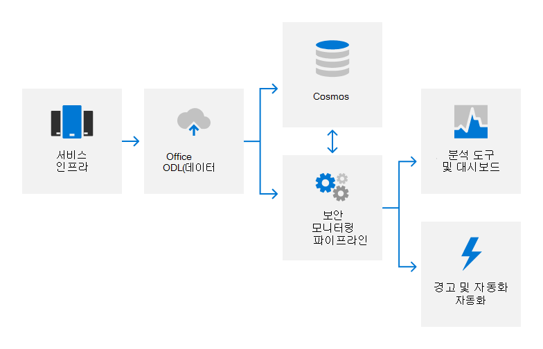

# 감사 로깅 개요Audit logging overview

## 감사 로깅을 Microsoft 365 어떻게 사용하나요?How does Microsoft 365 employ audit logging?

Microsoft 365 로깅을 통해 제품 및 서비스에서 권한이 없는 활동을 감지하고 Microsoft 직원에게 책임 제공Microsoft 365 employs audit logging to detect unauthorized activities in its products and services and provide accountability for Microsoft personnel. 감사 로그는 시스템 구성 변경 및 액세스 이벤트에 대한 세부 정보를 캡처하고, 활동의 책임자, 활동이 언제 및 장소가 났고, 활동의 결과를 식별하는 세부 정보를 제공합니다.Audit logs capture details about system configuration changes and access events, with details to identify who was responsible for the activity, when and where the activity took place, and what the outcome of the activity was. 자동화된 로그 분석은 의심스러운 동작의 거의 실시간 감지를 지원합니다.Automated log analysis supports near real-time detection of suspicious behavior. 잠재적인 인시던트는 추가 조사를 위해 Microsoft 365 보안 대응 팀으로 에스컬레이터됩니다.Potential incidents are escalated to the Microsoft 365 Security Response team for further investigation.

Microsoft 365 감사 로깅은 다음 등의 다양한 원본에서 로그 데이터를 캡처합니다.Microsoft 365 internal audit logging captures log data from various sources, such as:

- 이벤트 로그Event logs
- AppLocker 로그AppLocker logs
- 성능 데이터Performance data
- System Center 데이터System Center data
- 통화 정보 기록Call detail records
- 환경 품질 데이터Quality of experience data
- IIS 웹 서버 로그IIS Web Server logs
- SQL Server 로그SQL Server logs
- Syslog 데이터Syslog data
- 보안 감사 로그Security audit logs

## 감사 Microsoft 365 어떻게 중앙 집중화하고 보고하나요?How does Microsoft 365 centralize and report on audit logs?

여러 유형의 로그 데이터가 Microsoft 365 서버에서 NRT(거의 실시간) 분석 및 장기 저장소를 위한 내부 Cosmos(Big Data Computing Service)에 대한 독점 보안 모니터링 솔루션으로 업로드됩니다.Many different types of log data are uploaded from Microsoft 365 servers to a proprietary security monitoring solution for near real-time (NRT) analysis and an internal big data computing service (Cosmos) for long-term storage. 이 데이터 전송은 ODL(Office Data Loader)이라는 전용 자동화 도구를 사용하여 승인된 포트 및 프로토콜에서 FIPS 140-2 유효성이 검사된 TLS 연결을 통해 발생합니다.This data transfer occurs over a FIPS 140-2-validated TLS connection on approved ports and protocols using a proprietary automation tool called the Office Data Loader (ODL).

로그는 시스템 성능 지표 및 잠재적인 보안 이벤트를 감지하기 위해 규칙 기반, 통계 및 기계 학습 방법을 사용하여 NRT에서 처리됩니다.Logs are processed in NRT using rule-based, statistical, and machine learning methods to detect system performance indicators and potential security events. 기계 학습 모델은 수신 로그 데이터 및 기록 로그 데이터를 사용하여 Cosmos 기능을 지속적으로 개선합니다.Machine learning models use incoming log data and historical log data stored in Cosmos to continuously improve detection capabilities. 보안 관련 검색은 경고를 생성하여 통화 엔지니어에게 잠재적인 인시던트에 대해 알리고 해당하는 경우 자동화된 수정 작업을 트리거합니다.Security-related detections generate alerts, notifying on-call engineers of a potential incident and triggering automated remediation actions when applicable. 서비스 팀은 자동화된 보안 모니터링 외에도 데이터 상관 관계, 대화형 쿼리 및 데이터 분석을 위해 분석 도구 및 대시보드를 사용합니다.In addition to automated security monitoring, service teams use analysis tools and dashboards for data correlation, interactive queries, and data analytics. 이러한 보고서는 서비스의 전반적인 성능을 모니터링하고 개선하는 데 사용됩니다.These reports are used to monitor and improve the overall performance of the service.

보안 모니터링 및 경고에 대한 자세한 내용은 보안 모니터링 개요 [를 참조하세요.](assurance-security-monitoring.md)For more information on security monitoring and alerting, see the [Security monitoring overview](assurance-security-monitoring.md).

## 감사 로그를 Microsoft 365 어떻게 보호하나요?How does Microsoft 365 protect audit logs?

감사 레코드를 Microsoft 365 데 사용되는 도구는 원래 감사 레코드 콘텐츠 또는 시간 순서를 영구적으로 또는 돌이할 수 없는 변경을 허용하지 않습니다.The tools used in Microsoft 365 to collect and process audit records do not allow permanent or irreversible changes to the original audit record content or time ordering. 사용자 Microsoft 365 데이터에 대한 액세스는 Cosmos 권한이 있는 직원으로 제한됩니다.Access to Microsoft 365 data stored in Cosmos is restricted to authorized personnel. 또한 감사 Microsoft 365 감사 기능을 담당하는 보안 팀 구성원의 제한된 하위 집합으로 감사 로그 관리를 제한합니다.In addition, Microsoft 365 restricts the management of audit logs to a limited subset of Security team members responsible for audit functionality. 보안 팀은 보안 팀에 대한 관리자 액세스 권한이 Cosmos.The Security Team does not have standing administrative access to Cosmos. 관리 액세스에는 JIT(Just-In-Time) 액세스 승인이 필요하며, 관리에 대한 로깅 메커니즘의 모든 Cosmos 기록 및 감사됩니다.Administrative access requires Just-In-Time (JIT) access approval, and all changes to logging mechanisms for Cosmos are recorded and audited. 감사 로그는 인시던트 조사를 지원하고 규정 요구 사항을 충족하기에 충분히 오래 유지됩니다.Audit logs are retained long enough to support incident investigations and meet regulatory requirements. 서비스의 정확한 감사 로그 데이터 보존 기간은 Cosmos 팀에 의해 결정됩니다. 대부분의 감사 로그 데이터는 90일 이상 보존됩니다.The exact period of audit log data retention in Cosmos is determined by the service teams; most audit log data is retained for 90 days or longer.

## 감사 Microsoft 365 캡처할 수 있는 최종 사용자 식별 정보를 어떻게 보호하나요?How does Microsoft 365 protect end-user identifiable information that may be captured in audit logs?

로그 데이터를 업로드하기 전에 ODL 응용 프로그램은 스크러빙 서비스를 사용하여 테넌트 정보 및 최종 사용자 식별 가능 정보와 같은 고객 데이터가 포함된 모든 필드를 제거하고 해당 필드를 해시 값으로 바환합니다.Prior to uploading log data, the ODL application uses a scrubbing service to remove any fields that contain customer data, such as tenant information and end-user identifiable information, and replace those fields with a hash value. Anonymized and hashed logs are rewritten and then uploaded into Cosmos.The anonymized and hashed logs are rewritten and then uploaded into Cosmos. 모든 로그 전송은 TLS 암호화 연결(FIPS 140-2)을 통해 발생합니다.All log transfers occur over a TLS encrypted connection (FIPS 140-2).

## 인증을 위한 & 규정Related external regulations & certifications

Microsoft의 온라인 서비스는 외부 규정 및 인증을 준수하도록 정기적으로 감사됩니다.Microsoft's online services are regularly audited for compliance with external regulations and certifications. 감사 로깅과 관련된 컨트롤의 유효성 검사는 다음 표를 참조합니다.Refer to the following table for validation of controls related to audit logging.

| **외부 감사****External audits** | **섹션****Section** | **최신 보고서 날짜****Latest report date** |
|:--------------------|:------------|:-----------------------|
| [FedRAMP(Office 365)FedRAMP (Office 365)](https://compliance.microsoft.com/compliancemanager) | AU-2: 이벤트 감사AU-2: Audit events   AU-3: 감사 레코드의 콘텐츠AU-3: Content of audit records   AU-4: 감사 저장소 용량AU-4: Audit storage capacity   AU-5: 감사 처리 실패에 대한 응답AU-5: Response to audit processing failures   AU-6: 감사 검토, 분석 및 보고AU-6: Audit review, analysis, and reporting   AU-7: 감사 감소 및 보고서 생성AU-7: Audit reduction and report generation   AU-8: 타임스탬프AU-8: Time stamps   AU-9: 감사 정보 보호AU-9: Protection of audit information    AU-10: 부인하지 않는AU-10: Non-repudiation   AU-11: 감사 레코드 보존AU-11: Audit record retention   AU-12: 감사 생성AU-12: Audit generation  | 2020년 9월 24일September 24, 2020 | 
| [ISO 27001/27002(Office 365)ISO 27001/27002 (Office 365)](https://servicetrust.microsoft.com/ViewPage/MSComplianceGuideV3?command=Download&downloadType=Document&downloadId=8d625374-4f2d-49f8-9d37-a4281ba98222&tab=7027ead0-3d6b-11e9-b9e1-290b1eb4cdeb&docTab=7027ead0-3d6b-11e9-b9e1-290b1eb4cdeb_ISO_Reports)    [적용성 설명Statement of Applicability](https://servicetrust.microsoft.com/ViewPage/MSComplianceGuideV3?command=Download&downloadType=Document&downloadId=c0df4ce8-c77e-4183-84eb-c8688470d8b1&tab=7027ead0-3d6b-11e9-b9e1-290b1eb4cdeb&docTab=7027ead0-3d6b-11e9-b9e1-290b1eb4cdeb_ISO_Reports)   [인증Certification](https://servicetrust.microsoft.com/ViewPage/MSComplianceGuideV3?command=Download&downloadType=Document&downloadId=1e84a14a-2468-45ac-9412-5e53250d57ec&tab=7027ead0-3d6b-11e9-b9e1-290b1eb4cdeb&docTab=7027ead0-3d6b-11e9-b9e1-290b1eb4cdeb_ISO_Reports) | A.12.4: 로깅 및 모니터링A.12.4: Logging and monitoring | 2021년 4월 20일April 20, 2021 |
| [ISO 27017(Office 365)ISO 27017 (Office 365)](https://servicetrust.microsoft.com/ViewPage/MSComplianceGuideV3?command=Download&downloadType=Document&downloadId=8d625374-4f2d-49f8-9d37-a4281ba98222&tab=7027ead0-3d6b-11e9-b9e1-290b1eb4cdeb&docTab=7027ead0-3d6b-11e9-b9e1-290b1eb4cdeb_ISO_Reports)    [적용성 설명Statement of Applicability](https://servicetrust.microsoft.com/ViewPage/MSComplianceGuideV3?command=Download&downloadType=Document&downloadId=c0df4ce8-c77e-4183-84eb-c8688470d8b1&tab=7027ead0-3d6b-11e9-b9e1-290b1eb4cdeb&docTab=7027ead0-3d6b-11e9-b9e1-290b1eb4cdeb_ISO_Reports)   [인증Certification](https://servicetrust.microsoft.com/ViewPage/MSComplianceGuideV3?command=Download&downloadType=Document&downloadId=70de0999-5451-43a3-9ef4-761e8fbfb1a3&tab=7027ead0-3d6b-11e9-b9e1-290b1eb4cdeb&docTab=7027ead0-3d6b-11e9-b9e1-290b1eb4cdeb_ISO_Reports) | A.12.4: 로깅 및 모니터링A.12.4: Logging and monitoring | 2021년 4월 20일April 20, 2021 |
| [SOC 1(Office 365)SOC 1 (Office 365)](https://servicetrust.microsoft.com/ViewPage/MSComplianceGuideV3?command=Download&downloadType=Document&downloadId=90df3f9c-3aaf-4dbf-99d0-ca9f2991721b&tab=7027ead0-3d6b-11e9-b9e1-290b1eb4cdeb&docTab=7027ead0-3d6b-11e9-b9e1-290b1eb4cdeb_SOC_%2F_SSAE_16_Reports) | CA-48: 데이터 센터 로깅CA-48: Datacenter logging   CA-60: 감사 로깅CA-60: Audit logging | 2020년 12월 24일December 24, 2020 |
| [SOC 2(Office 365)SOC 2 (Office 365)](https://servicetrust.microsoft.com/ViewPage/MSComplianceGuideV3?command=Download&downloadType=Document&downloadId=a73c1738-7892-42b7-acd3-87b6371c53f6&tab=7027ead0-3d6b-11e9-b9e1-290b1eb4cdeb&docTab=7027ead0-3d6b-11e9-b9e1-290b1eb4cdeb_SOC_%2F_SSAE_16_Reports) | CA-48: 데이터 센터 로깅CA-48: Datacenter logging   CA-60: 감사 로깅CA-60: Audit logging | 2020년 12월 24일December 24, 2020|