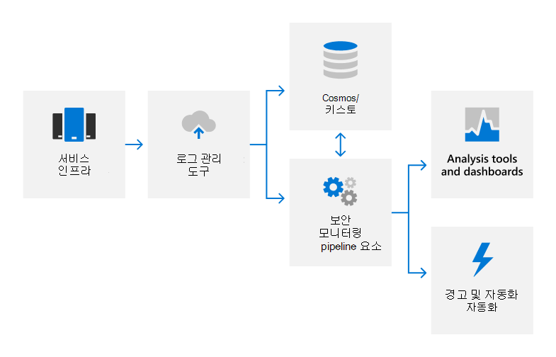

# 감사 로깅 개요

## 감사 로깅을 Microsoft 365 어떻게 사용하나요?

Microsoft 365 로깅을 통해 제품 및 서비스에서 권한이 없는 활동을 감지하고 Microsoft 직원에게 책임 제공 감사 로그는 시스템 구성 변경 및 액세스 이벤트에 대한 세부 정보를 캡처하고, 활동의 책임자, 활동이 언제 및 장소가 났고, 활동의 결과를 식별하는 세부 정보를 제공합니다. 자동화된 로그 분석은 의심스러운 동작의 거의 실시간 감지를 지원합니다. 잠재적인 인시던트는 추가 조사를 위해 Microsoft 365 보안 대응 팀으로 에스컬레이터됩니다.

Microsoft 365 감사 로깅은 다음 등의 다양한 원본에서 로그 데이터를 캡처합니다.

- 이벤트 로그
- AppLocker 로그
- 성능 데이터
- System Center 데이터
- 통화 정보 기록
- 환경 품질 데이터
- IIS 웹 서버 로그
- SQL Server 로그
- Syslog 데이터
- 보안 감사 로그

## 감사 Microsoft 365 어떻게 중앙 집중화하고 보고하나요?

여러 유형의 로그 데이터가 Microsoft 365 서버에서 NRT(거의 실시간) 분석 및 장기 저장소를 위한 내부 Cosmos(Big Data Computing Service)에 대한 독점 보안 모니터링 솔루션으로 업로드됩니다. 이 데이터 전송은 ODL(Office Data Loader)이라는 전용 자동화 도구를 사용하여 승인된 포트 및 프로토콜에서 FIPS 140-2 유효성이 검사된 TLS 연결을 통해 발생합니다.

로그는 시스템 성능 지표 및 잠재적인 보안 이벤트를 감지하기 위해 규칙 기반, 통계 및 기계 학습 방법을 사용하여 NRT에서 처리됩니다. 기계 학습 모델은 수신 로그 데이터 및 기록 로그 데이터를 사용하여 Cosmos 기능을 지속적으로 개선합니다. 보안 관련 검색은 경고를 생성하여 통화 엔지니어에게 잠재적인 인시던트에 대해 알리고 해당하는 경우 자동화된 수정 작업을 트리거합니다. 서비스 팀은 자동화된 보안 모니터링 외에도 데이터 상관 관계, 대화형 쿼리 및 데이터 분석을 위해 분석 도구 및 대시보드를 사용합니다. 이러한 보고서는 서비스의 전반적인 성능을 모니터링하고 개선하는 데 사용됩니다.

보안 모니터링 및 경고에 대한 자세한 내용은 보안 모니터링 개요 [를 참조하세요.](assurance-security-monitoring.md)

## 감사 로그를 Microsoft 365 어떻게 보호하나요?

감사 레코드를 Microsoft 365 데 사용되는 도구는 원래 감사 레코드 콘텐츠 또는 시간 순서를 영구적으로 또는 돌이할 수 없는 변경을 허용하지 않습니다. 사용자 Microsoft 365 데이터에 대한 액세스는 Cosmos 권한이 있는 직원으로 제한됩니다. 또한 감사 Microsoft 365 감사 기능을 담당하는 보안 팀 구성원의 제한된 하위 집합으로 감사 로그 관리를 제한합니다. 보안 팀은 보안 팀에 대한 관리자 액세스 권한이 Cosmos. 관리 액세스에는 JIT(Just-In-Time) 액세스 승인이 필요하며, 관리에 대한 로깅 메커니즘의 모든 Cosmos 기록 및 감사됩니다. 감사 로그는 인시던트 조사를 지원하고 규정 요구 사항을 충족하기에 충분히 오래 유지됩니다. 서비스의 정확한 감사 로그 데이터 보존 기간은 Cosmos 팀에 의해 결정됩니다. 대부분의 감사 로그 데이터는 90일 이상 보존됩니다.

## 감사 Microsoft 365 캡처할 수 있는 최종 사용자 식별 정보를 어떻게 보호하나요?

로그 데이터를 업로드하기 전에 ODL 응용 프로그램은 스크러빙 서비스를 사용하여 테넌트 정보 및 최종 사용자 식별 가능 정보와 같은 고객 데이터가 포함된 모든 필드를 제거하고 해당 필드를 해시 값으로 바환합니다. Anonymized and hashed logs are rewritten and then uploaded into Cosmos. 모든 로그 전송은 TLS 암호화 연결(FIPS 140-2)을 통해 발생합니다.

## 인증을 위한 & 규정

Microsoft의 온라인 서비스는 외부 규정 및 인증을 준수하도록 정기적으로 감사됩니다. 감사 로깅과 관련된 컨트롤의 유효성 검사는 다음 표를 참조합니다.

| **외부 감사** | **섹션** | **최신 보고서 날짜** |
|:--------------------|:------------|:-----------------------|
| [FedRAMP(Office 365)](https://compliance.microsoft.com/compliancemanager) | AU-2: 이벤트 감사   AU-3: 감사 레코드의 콘텐츠   AU-4: 감사 저장소 용량   AU-5: 감사 처리 실패에 대한 응답   AU-6: 감사 검토, 분석 및 보고   AU-7: 감사 감소 및 보고서 생성   AU-8: 타임스탬프   AU-9: 감사 정보 보호    AU-10: 부인하지 않는   AU-11: 감사 레코드 보존   AU-12: 감사 생성  | 2020년 9월 24일 | 
| [ISO 27001/27002(Office 365)](https://servicetrust.microsoft.com/ViewPage/MSComplianceGuideV3?command=Download&downloadType=Document&downloadId=8d625374-4f2d-49f8-9d37-a4281ba98222&tab=7027ead0-3d6b-11e9-b9e1-290b1eb4cdeb&docTab=7027ead0-3d6b-11e9-b9e1-290b1eb4cdeb_ISO_Reports)    [적용성 설명](https://servicetrust.microsoft.com/ViewPage/MSComplianceGuideV3?command=Download&downloadType=Document&downloadId=c0df4ce8-c77e-4183-84eb-c8688470d8b1&tab=7027ead0-3d6b-11e9-b9e1-290b1eb4cdeb&docTab=7027ead0-3d6b-11e9-b9e1-290b1eb4cdeb_ISO_Reports)   [인증](https://servicetrust.microsoft.com/ViewPage/MSComplianceGuideV3?command=Download&downloadType=Document&downloadId=1e84a14a-2468-45ac-9412-5e53250d57ec&tab=7027ead0-3d6b-11e9-b9e1-290b1eb4cdeb&docTab=7027ead0-3d6b-11e9-b9e1-290b1eb4cdeb_ISO_Reports) | A.12.4: 로깅 및 모니터링 | 2021년 4월 20일 |
| [ISO 27017(Office 365)](https://servicetrust.microsoft.com/ViewPage/MSComplianceGuideV3?command=Download&downloadType=Document&downloadId=8d625374-4f2d-49f8-9d37-a4281ba98222&tab=7027ead0-3d6b-11e9-b9e1-290b1eb4cdeb&docTab=7027ead0-3d6b-11e9-b9e1-290b1eb4cdeb_ISO_Reports)    [적용성 설명](https://servicetrust.microsoft.com/ViewPage/MSComplianceGuideV3?command=Download&downloadType=Document&downloadId=c0df4ce8-c77e-4183-84eb-c8688470d8b1&tab=7027ead0-3d6b-11e9-b9e1-290b1eb4cdeb&docTab=7027ead0-3d6b-11e9-b9e1-290b1eb4cdeb_ISO_Reports)   [인증](https://servicetrust.microsoft.com/ViewPage/MSComplianceGuideV3?command=Download&downloadType=Document&downloadId=70de0999-5451-43a3-9ef4-761e8fbfb1a3&tab=7027ead0-3d6b-11e9-b9e1-290b1eb4cdeb&docTab=7027ead0-3d6b-11e9-b9e1-290b1eb4cdeb_ISO_Reports) | A.12.4: 로깅 및 모니터링 | 2021년 4월 20일 |
| [SOC 1(Office 365)](https://servicetrust.microsoft.com/ViewPage/MSComplianceGuideV3?command=Download&downloadType=Document&downloadId=90df3f9c-3aaf-4dbf-99d0-ca9f2991721b&tab=7027ead0-3d6b-11e9-b9e1-290b1eb4cdeb&docTab=7027ead0-3d6b-11e9-b9e1-290b1eb4cdeb_SOC_%2F_SSAE_16_Reports) | CA-48: 데이터 센터 로깅   CA-60: 감사 로깅 | 2020년 12월 24일 |
| [SOC 2(Office 365)](https://servicetrust.microsoft.com/ViewPage/MSComplianceGuideV3?command=Download&downloadType=Document&downloadId=a73c1738-7892-42b7-acd3-87b6371c53f6&tab=7027ead0-3d6b-11e9-b9e1-290b1eb4cdeb&docTab=7027ead0-3d6b-11e9-b9e1-290b1eb4cdeb_SOC_%2F_SSAE_16_Reports) | CA-48: 데이터 센터 로깅   CA-60: 감사 로깅 | 2020년 12월 24일|