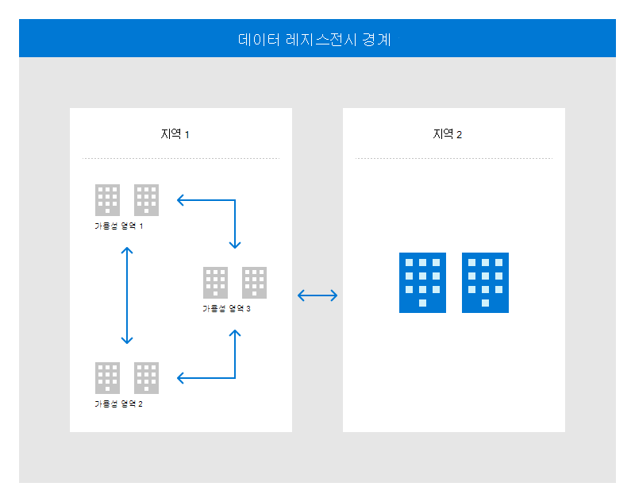

# 데이터 센터 아키텍처 및 인프라

Microsoft 데이터 센터는 클라우드 아키텍처를 안정적으로 보호하기 위한 여러 보호책 계층을 활용하고 인프라를 지원하는 심층 방어 전략을 구현하도록 디자인되었습니다. 중복성은 데이터 센터 가용성을 지원하기 위해 여러 수준의 모든 시스템에 기본 제공됩니다.

Microsoft는 전 세계에 분산된 데이터 센터 인프라를 만들어 수천 개의 온라인 서비스를 지원하고 보안이 유지되는 데이터 센터 시설을 구축하고 있습니다. 이 전역 분산 인프라는 응용 프로그램을 사용자에게 더 가깝게 설정하고, 데이터 보존을 유지하며, 고객에게 포괄적인 규정 준수 및 탄력성 옵션을 제공하도록 설계되었습니다.

지역은 대규모의 탄력적인 네트워크를 통해 상호 연결되는 데이터 센터 집합입니다. 지역은 지역으로 구성되어 고객에게 특정 데이터 및 규정 준수를 부여하기 위해 데이터 및 응용 프로그램을 닫을 수 있는 권한이 필요합니다. 기본 제공 내결결성은 지역이 전용 대용량 네트워킹 인프라에 대한 연결을 통해 전체 지역 장애를 견디는 데 사용할 수 있도록 합니다.

지역 내의 물리적으로 분리된 위치를 가용성 영역이라고 합니다. 각 위치는 독립적인 전원, 냉각 및 네트워킹이 탑재된 하나 이상의 데이터 센터로 구성됩니다. 가용성 영역은 중요 중요 응용 프로그램을 고가용성 및 짧은 대기 시간 복제로 실행할 수 있도록 합니다.

다음 그림에서는 전역 인프라가 고가용성, 재해 복구 및 백업을 위해 동일한 데이터 유지 경계 내의 지역 및 가용성 지역을 쌍으로 지정하는 방법을 보여줍니다.

Microsoft는 지리적으로 분산된 데이터 센터를 통해 서비스를 고객에게 더 가까이 제공하고, 네트워크 대기 시간을 줄이고, 지리적 중복 백업 및 장애 조치(failover)를 허용할 수 있습니다.

## 사용 가능성

Microsoft 데이터 센터는 고객 SLA 및 서비스 요구를 충족하기 위해 99.999% 가용성을 제공하게 설계됩니다. Microsoft는 24x7x365 서비스를 제공하는 시설의 전 세계 운영, 관리, 네트워크 및 지속 가능성에 큰 투자를 합니다.

## 규정 준수 표준 및 요구 사항

Microsoft는 전 세계 인프라를 구축하는 데 150억 달러 이상을 투자하고 연구 및 개발에 90억 달러를 투자하여 효율성을 높이고 혁신을 주도하고 있습니다. 따라서 Microsoft의 데이터 센터는 업계의 많은 시설에 비해 속도가 더 빠른 속도로 발전하고 있으며, 따라서 기존 데이터 센터 표준에 명시된 규정 요구 사항을 따르지 않습니다. Microsoft는 세계 최대 데이터 센터 포트폴리오 중 하나를 실행하는 데 제공하는 풍부한 운영 통찰력 외에도 IEEE 골드북 데이터 및 타사 안정성 시뮬레이션 소프트웨어를 사용하여 데이터 센터 디자인 표준을 지속적으로 개선합니다. Microsoft 데이터 센터는 규정 준수 포트폴리오에서 호출된 여러 규제 감사의 일부로 광범위하게 감사됩니다. Microsoft 데이터 센터의 성숙도 수준은 규정 준수 포트폴리오와 특히 ISO 22301 인증을 통해 평가할 수 있습니다.

Microsoft는 ANSI/TIA-942 Telecommunications Infrastructure of Datacenters Standard와 연계하여 프로그램을 운영하는 반면, 이 표준의 일부는 Microsoft에 적용되지 않습니다. 또는 다른 규제 및/또는 국가별 요구 사항과 충돌합니다. 또한 Microsoft는 고객의 요구에 맞기 위해 더 많은 성능 기반 접근 방식을 사용하기로 선택했습니다.

## 데이터 및 네트워크 중복성

중요한 데이터 센터 기능은 여러 계층의 중복 시스템을 사용하여 오류를 유지하고 서비스 중단을 최소화합니다. 디스크 수준의 로컬 중복 스토리지는 지역 간 중복성을 제공하는 지역 중복 스토리지를 사용하여 지역 내 데이터를 보호합니다. 신뢰할 수 있는 네트워크 통신을 보장하기 위해 Microsoft는 다양한 파이버 경로 및 중복 하드웨어를 소유하고 활용하여 오류 또는 서비스 중단으로부터 중요한 구성 요소를 보호합니다.

지리적 복제는 대체 지리적 위치에 대한 중복을 제공하는 데 사용됩니다. 데이터 지속성은 서로 다른 데이터 센터의 여러 데이터베이스에 대해 동기적으로 데이터를 복제하여 얻을 수 있습니다. 클라우드에서 소유한 모든 백업 데이터에 대해 복원 테스트가 수행됩니다. 재해 복구는 다른 지리적 지역에 있는 데이터 센터에 대한 비동기 복제를 통해 달성됩니다.

## 용량

클라우드 운영은 필요한 용량이 구조화 및 고객 및 내부적으로 사용할 수 있도록 향후 요구 사항을 예측하는 전용 용량 팀입니다. 적절한 서비스 성능, 가용성, 서비스 사용률, 저장소 사용률, 네트워크 대기 시간 및 감사 로그 용량을 보장하기 위해 시스템을 모니터링합니다. 또한 Microsoft는 대역폭, 트랜잭션 용량 및 저장소 용량에 대한 서비스 거부 공격의 영향으로부터 데이터 센터를 보호합니다.

모든 서비스 팀은 정보 처리, 통신 및 환경 지원에 필요한 용량을 확보하기 위해 용량 계획을 데이터 센터 모델 및 데이터 복제 계획의 주요 기능으로 포함합니다.

## 전원

Microsoft의 데이터 센터에는 백업 전원을 제공하는 현장 생성기를 포함하는 24x7 UPS(무정전 전원 공급 장치) 및 긴급 전원 지원이 있습니다. UPS와 발전기 모두에 정기 유지 관리 및 테스트를 시행하며 운영팀은 긴급 연료 공급을 위해 현지 공급 업체와 계약 협정을 맺고 있습니다. 데이터 센터에는 또한 중요한 전기 구성 요소를 포함한 전력 시스템을 모니터링하는 전용 시설 운영 센터가 있습니다.

Microsoft 데이터 센터에는 케이블에 대한 보호 공간 및 적절한 레이블 지정이 탑재되어 있습니다. 전원 인프라 장비는 환경적 위험으로부터 보호하기 위해 설계된 환경에 배치됩니다. 도난 또는 이동 손상으로부터 보호하려면 모든 이식 가능한 온라인 서비스의 자산을 잠그거나 고정해야 합니다. 전원 케이블은 이동 부분 및 우발적인 손상으로부터 보호하기 위해 바닥, 케이블 트레이의 오버헤드 및 캐비닛 내에서 실행됩니다. 모든 전기 공간은 카드 판독기 또는 적절한 추가 키 잠금 뒤에 있습니다. 액세스 복도, 외부 입구 및 장비 야드는 모두 비디오 감시를 통해 모니터링됩니다. 또한 전원 시스템은 기능 및 생성기 및 UPS 시스템에 여러 전원/유틸리티 공급이 있는 보호 형태로 중복을 활용합니다.

최소한의 필요한 운영 기능으로 전원을 유지할 수 있는 정보 시스템에 대해 장기 대체 전원 공급이 구현됩니다. 전원이 실패하거나 감당할 수 없는 수준으로 내려가면 UPS 시스템이 즉시 온라인이 됩니다. 이렇게 하면 생성기가 인계할 수 있을 때까지 서버를 실행하기에 충분한 전원이 필요합니다. 비상 생성기는 확장된 정전, 계획된 유지 관리에 대한 백업 기능을 제공하고, 자연 재해가 발생할 경우 현장 연비 예약으로 데이터 센터를 운영할 수 있습니다.

Microsoft 데이터 센터(임대 및 완전히 관리)는 UPS 및 생성기 시스템에서 백업하는 전용 회로의 오버헤드 비상 조명 형태로 비상 조명을 구현합니다. 자동 비상 조명은 NFPA(국가 화재 및 보호 협회) 수명 안전 코드 또는 해당 현지 코드/법률에 따라 구현됩니다. 유틸리티 전원이 손실된 경우 비상 조명은 UPS 및 생성기 시스템에서 제공하는 전원으로 자동으로 전환됩니다. 데이터 센터 내의 비상 조명 시스템은 일상적인 유지 관리 작업을 통해 적절한 작동 순서를 유지하도록 합니다.

## 유지 관리

시스템 유지 관리 정책 및 절차는 Microsoft의 온라인 서비스 물리적 및 환경 보안 표준에 *따라 수행됩니다.* 모든 Microsoft 장비 및 시스템은 운영 효율성을 보장하기 위해 정기적으로 유지 관리됩니다. 모든 장비 또는 시스템의 유지 관리는 제조업체의 권장 사항에 따라 수행하고, 승인된 직원이 수행하고, 유지 관리 티켓에 기록되어야 합니다.

서로 다른 유형의 시스템을 유지 관리하는 두 가지 자산 팀이 있습니다.

- **중요 환경(CE) 팀:**

    - CE는 시설의 운영 인프라를 구성하는 전기, 기계 및 물리적 시스템에 대한 시설 관리를 제공하는 팀입니다. CE 팀에서는 CE 구성 요소에 대한 모든 유지 관리 작업을 예약, 수행, 문서화 및 검토합니다. Microsoft 데이터 센터는 컴퓨터화된 시스템을 사용하여 유지 관리 일정 및 작업 주문을 관리합니다.
    - DCM(데이터 센터 관리)은 사이트 또는 원격으로 수행되는 모든 CE 유지 관리를 담당합니다. CE 유지 관리는 MOP(절차 방법)라는 필수 단계별 문서에 설명되어 있습니다. 작업을 시작하기 전에 데이터 센터 관리에서 MOP를 검토/승인합니다.

- **사이트 서비스** 팀:

    - 사이트 서비스는 Microsoft 데이터 센터에 있는 Microsoft 온라인 서비스 자산의 서비스를 제공하는 팀입니다. DC 사이트 서비스 팀은 데이터 센터의 속성 프로비전 서비스에 속하는 자산에 대해 스마트 핸즈/중단 수정 서비스를 제공합니다. 예를 들어 물리적 유지 관리가 필요한 자산은 DC 사이트 서비스 팀에서 스마트 핸즈 서비스를 요청할 수 있습니다. Microsoft 자산에 대한 모든 사이트 서비스는 워크플로 티켓 지정 도구 내의 작업 티켓에서 예약, 수행, 문서화 및 검토됩니다. 승인된 작업 티켓이 없는 경우 어떤 작업도 수행할 수 없습니다.
    - TPM(기술 프로그램 관리자) 및 DCM 팀은 데이터 센터에서 발생하는 모든 사이트 서비스 작업과 자산을 오프사이트로 전송해야 하는 작업을 담당합니다. 사이트 서비스 유지 관리는 물리적 보안 메커니즘에 의해 제어 및 보호되는 데이터 센터 영역에서 수행됩니다.

시설에서 CE 구성 요소를 제거해야 하는 경우 DCM에서 장비 처리를 승인합니다. 대부분의 경우 CE 구성 요소는 부지 유지 관리 서비스를 받으며 시설에서 제거되지 않습니다. 오프사이트 전송이 필요한 속성 자산(예: 네트워크 장치 또는 서버)에는 명시적인 자산 소유자 승인이 있어야 합니다.

클라우드 내의 디지털 미디어는 폐기하기 위해 이동하지 않는 한 코로케이션 공간에서 전송되지 않을 수 있습니다. 이러한 자산을 폐기할 경우 CCTV 카메라 범위 아래에 있는 잠긴 저장소에 저장됩니다. 자산을 파기할 준비가 된 경우 자산 관리의 물리적 보안 책임자 및 Microsoft 전일 직원은 잠긴 보관함의 호위를 시작하여 해당 위치의 파기할 위치로 호위해야 합니다. 데이터 센터와 Microsoft의 감독 하에, Microsoft 자산은 데이터 센터의 제어 영역을 떠날 수 없습니다.

시스템 유지 관리 도구에 대한 액세스를 포함하여 작업 시작 전에 모든 유지 관리 작업을 승인해야 합니다. Microsoft 인프라는 DCAT(데이터 센터 액세스 도구) 내에서 액세스 수준을 만들어 유지 관리 도구 제어를 구현했습니다. 각 시설에는 특수 유지 관리 도구의 저장을 위한 제한된 물리적 잠금 상자 또는 액세스 제어 공간이 포함되어 있습니다. 잠금 상자 또는 저장소 공간에 대한 액세스는 DCAT 도구에서 제어되어 유지 관리 도구에 대한 무단 액세스를 금지합니다. 이 프로그램은 승인된 액세스 권한이 있는 직원만 도구에 액세스할 수 있도록 합니다. 사이트 서비스 팀은 일상적인 인벤토리 검사를 수행하여 모든 도구의 상태를 검증합니다. 분기별 기준으로 데이터 센터 관리 팀과 물리적 보안 팀은 DCAT 액세스 목록에 대한 감사를 수행하여 유지 관리 담당자의 액세스 목록을 최신으로 유지 관리합니다. 직원 종료 또는 이전은 액세스 목록의 수동 업데이트를 통해 즉시 반영됩니다. 잠금 상자 또는 유지 관리 저장소 공간에 대한 액세스는 모든 조사에 사용할 수 있는 액세스 배지 판독기 로그에서 추적됩니다.

사이트 서비스 팀은 데이터 센터 내에서 사용할 승인된 유지 관리 도구의 인벤토리를 유지 관리합니다. 유지 관리 담당자는 제공된 유지 관리 도구를 사용할 수 있도록 지시됩니다. 데이터 센터에서 제공하지 않는 도구를 사용하려면 DCM(데이터 센터 관리) 승인이 필요합니다. 실제 손 도구는 이 유형의 제어에서 제외됩니다.

Microsoft 데이터 센터는 상주 유지 관리 담당자를 유지 관리하여 중요한 데이터 센터 인프라 시스템(중요 환경 팀) 및 데이터 센터 운영(사이트 서비스 팀)을 지원합니다. 중요 환경 및 사이트 서비스 팀은 현장에 대한 스패어를 유지 관리하는 중요한 보안 및 기술 시스템 구성 요소를 확인했습니다. 중요한 정보 시스템 서비스는 데이터 센터 중 하나의 인시던트로 인한 서비스 중단을 방지하기 위해 두 개 이상의 데이터 센터에서 프로비전됩니다.
