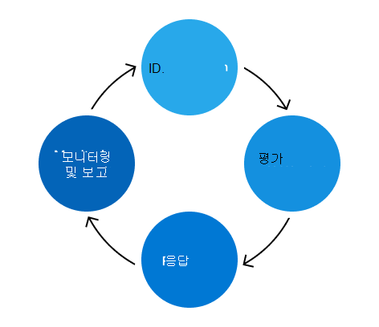

# Microsoft 365 위험 관리 프로그램

위험 관리 Microsoft 365 프로그램의 목적은 위험 관리에 대한 위험을 식별, 평가 및 관리하는 Microsoft 365. Microsoft의 최우선 과제는 고객, 데이터 및 신뢰뿐만 아니라 서비스 인프라에 영향을 줄 수 있는 위험을 사전 예방적으로 식별하고 해결하는 것입니다. 또한 계약상 의무를 충족하고 고객이 자체 규정 준수 요구 사항을 충족하는 데 필요한 공개 인증을 유지 관리하기 위해 강력한 위험 관리 프로그램이 필요합니다. Microsoft 365 관리 프로그램은 독립적으로 작동하지만 ERM(위험 관리) Enterprise 정책, 우선 순위 및 방법에 따라 조정됩니다. ERM 프로그램을 사용하여 여러 사업부와 엔지니어링 그룹을 일관되게 비교할 수 있으며, 기업 전체의 위험 관리에 보다 일관성 있는 접근법을 제공합니다.

Microsoft 365 보안 팀은 Microsoft 365 관리 프로그램을 관리하고 ERM 프로그램에서 정의한 활동을 담당합니다. 보안 팀은 위험 관리 프로그램을 더 효과적이고 효율적으로 만들기 위해 기존 Microsoft 365 엔지니어링, 서비스 운영 및 규정 준수 프로세스와 위험 관리 프레임워크를 통합하는 데 중점을 습니다.

또한 보안 팀은 규정 준수 Microsoft 365 적절히 구현할 때 엔지니어링 팀이 주요 규정 및 인증을 준수할 수 있도록 하는 합리화된 컨트롤 집합인 Microsoft 365 Controls Framework를 유지 관리합니다. 이 프레임워크는 위험 관리 프로세스의 일부로 피드백 및 결과를 기반으로 지속적으로 업데이트됩니다.

위험 관리 활동은 식별, 평가, 대응, 모니터링 및 보고의 네 단계로 나타 집니다.

## Identification

위험 관리 프로세스는 모든 주요 제어 영역, 내부 및 외부 위협 및 보안 환경의 취약성에 대해 가능한 모든 위험을 식별하는 Microsoft 365 시작합니다. 이 프로세스를 안내하는 정보는 인터뷰, 취약성 검사, 공격 시뮬레이션 연습, 감사 결과 및 인시던트 관리 활동을 비롯한 여러 소스에서 온 것입니다.

트러스트 팀은 이전에 식별된 위험 및 서비스 증가 시 발생할 수 있는 잠재적인 미래 위험에 대해 여러 서비스 팀의 주제 전문가(중소기업)를 인터뷰합니다. 또한 중소기업은 다른 연속 모니터링 원본에서 식별된 위험의 정확성과 완전성을 검증하는 데 도움이 됩니다.

또한 식별 단계는 의사 결정 로그, 활성 보안 및 규정 준수 예외, 이전 위험 평가의 완화 작업을 검토하는 경우입니다.

## 평가

식별된 각 위험은 영향, 가능성 및 컨트롤 결함의 세 가지 메트릭을 사용하여 평가됩니다.

- 영향은 해당 위험을 실현해야 하는 경우 서비스, 비즈니스 또는 Microsoft에 발생할 수 있는 손해를 참조합니다. Microsoft에 미치는 영향에는 신뢰도 손상, 고객 손실 또는 법적/규정 준수 영향이 포함됩니다.
- 가능성은 실현될 잠재적 위험의 확률을 정의하고 발생할 확률과 빈도를 분석하여 계산됩니다.
- 컨트롤 결함은 구현된 완화 컨트롤의 효과를 측정합니다.

이러한 메트릭은 기존 완화 전략을 고려하여 각 위험의 심각성을 나타내는 위험 점수를 계산하는 데 사용됩니다. 위험은 각 서비스의 주요 이해 관계자에게 집계되고 제공되어 위험 Microsoft 365 완전성을 확인할 수 있습니다.

## 응답

트러스트 팀은 확인된 위험 목록을 사용하여 Microsoft 365 서비스에 위험을 할당하여 위험 대응을 합니다. 정의된 지침은 위험 점수 및 제어 효율성에 따라 적절한 위험 대응 전략을 결정하는 데 도움이 됩니다. 위험 대응 전략은 네 가지 범주로 나뉩니다.

- 허용: 통제 수준이 낮고 위험도가 낮은 노출 영역입니다.
- 운영: 통제가 적절하다고 판단되는 위험도가 낮은 노출 영역입니다.
- 모니터: 통제가 적절하다고 판단되고 효과를 모니터링해야 하는 위험도가 높은 노출 영역입니다.
- 개선: 낮은 수준의 제어로 고위험 노출 영역이 해결의 최우선 순위입니다.

보안 팀은 서비스 팀과 협의하여 각 위험을 해결하기 위한 계획을 개발합니다. 심각도 수준에 따라 각 계획에 대한 적절한 검토 및 승인 수준이 결정됩니다. 작업이 필요한 위험의 경우 기존 엔지니어링 버그 프로세스가 추적, 관리 및 예외 결정을 내리는 데 사용됩니다. 엔지니어링 및 운영 팀에 익숙한 프로세스를 사용하면 위험 대응이 더 효율적이고 효과적입니다.

## 모니터링 및 보고

위험 평가의 일부로 식별된 위험은 모니터링되고 관련 이해 관계자에게 보고됩니다. 모니터링 전략에는 보안 모니터링, 주기적인 위험 검토, 침투 테스트 및 취약점 검사가 포함됩니다. 이러한 모니터링 노력은 주요 성과 지표에 대한 보고, 대시보드 만들기 및 공식 보고서 개발을 위한 데이터 원본 역할을 하여 향후의 위험 결정에 대해 알릴 수 있습니다.

트러스트 팀은 1년에 여러 번 각 서비스의 위험 소유자와 만나 위험 점수를 검토하고, 작업 계획의 효율성을 평가하고, 필요한 경우 업데이트를 진행합니다. 또한 Microsoft 365 위험 평가 활동은 Microsoft의 고위 경영진 및 ERM 프로그램에 대한 Microsoft의 위험 Enterprise 개요를 제공하는 ERM 프로그램의 Enterprise 위험 평가에 기여합니다.
