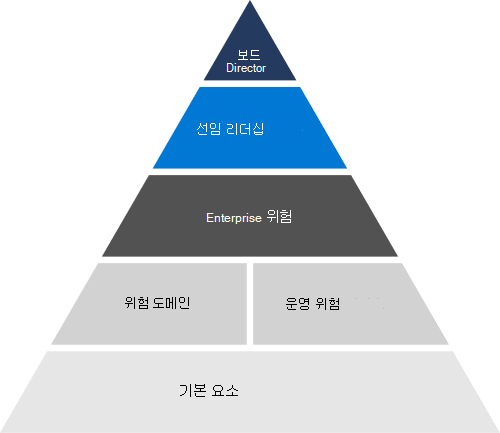

# 리스크 관리 개요

## Microsoft는 기업 전체의 위험을 어떻게 평가하고 관리하나요?

위험 관리는 회사 또는 고객 목표에 영향을 줄 수 있는 위협 또는 이벤트를 식별, 평가 및 대응하는 프로세스입니다. Microsoft의 위험 관리는 새로운 위협을 예측하고 클라우드 시스템과 이를 사용하는 고객에게 지속적인 보안을 제공하도록 설계되었습니다.

Microsoft의 위험 관리는 Enterprise ERM(위험 관리) 프레임워크에 부합합니다. ERM을 사용하면 전반적인 엔터프라이즈 위험 관리 프로세스가 가능하며 기업 전체의 관리와 협력하여 Microsoft의 가장 중요한 위험에 대한 책임을 식별하고 보장합니다.

Microsoft ERM은 기업 전체에서 일반적인 위험 관리 원칙을 가능하게 하여 사업부가 일관되고 비교적인 위험 평가를 독립적으로 지원할 수 있도록 합니다. 이러한 조정을 통해 Microsoft는 관리에 대한 통합된 방식으로 위험 정보를 집계하고 보고할 수 있습니다. ERM은 Microsoft의 사업부에 위험 관리 프로세스에 대한 일반적인 방법론, 도구 및 목표를 제공합니다. Microsoft 365 및 기타 엔지니어링 그룹 및 사업부는 이러한 도구를 사용하여 ERM의 지침에 따라 자체 위험 관리 프로그램의 일부로 개별 위험 평가를 실시합니다.

## Microsoft 온라인 서비스는 ERM에서 어떻게 작동하나요?

각 온라인 서비스는 ERM 지침을 따라 각 온라인 서비스에서 위험을 Microsoft 서비스. 이 프로그램은 ERM 프레임워크를 기존 Microsoft 엔지니어링, 서비스 운영 및 규정 준수 프로세스와 맞추는 데 중점을 두어 위험 관리 프로그램을 보다 효과적이고 효율적으로 만듭니다. 각 온라인 서비스의 위험 관리 활동은 궁극적으로 ERM 프로세스에 롤업하고 알릴 수 있습니다.

위험 평가 활동의 일부로, 각 온라인 서비스는 Microsoft Controls Framework(프레임워크)의 일부로 구현된 컨트롤의 디자인 및 운영 효율성을 분석합니다. 프레임워크는 규정 준수 활동 지원과 함께 적절히 구현될 때 엔지니어링 팀이 주요 규정 및 인증을 준수할 수 있도록 하는 합리화된 제어 집합입니다.

## 인증을 위한 & 규정

Microsoft의 온라인 서비스는 외부 규정 및 인증을 준수하도록 정기적으로 감사됩니다. 위험 관리와 관련된 컨트롤의 유효성 검사는 다음 표를 참조합니다.

### Azure 및 Dynamics 365

| **외부 감사** | **섹션** | **최신 보고서 날짜** |
|:--------------------|:------------|:-----------------------|
| [ISO 27001/27002](https://servicetrust.microsoft.com/ViewPage/MSComplianceGuideV3?command=Download&downloadType=Document&downloadId=e9116047-f327-430c-a83f-166b7e561ad6&tab=7027ead0-3d6b-11e9-b9e1-290b1eb4cdeb&docTab=7027ead0-3d6b-11e9-b9e1-290b1eb4cdeb_ISO_Reports)    [적용성 설명](https://servicetrust.microsoft.com/ViewPage/MSComplianceGuideV3?command=Download&downloadType=Document&downloadId=00af6c3e-7f3e-4e0d-8b0e-79f45ef2cef1&tab=7027ead0-3d6b-11e9-b9e1-290b1eb4cdeb&docTab=7027ead0-3d6b-11e9-b9e1-290b1eb4cdeb_ISO_Reports)   [인증](https://servicetrust.microsoft.com/ViewPage/MSComplianceGuideV3?command=Download&downloadType=Document&downloadId=d7af5304-3a31-40e6-9abb-e26352305d41&tab=7027ead0-3d6b-11e9-b9e1-290b1eb4cdeb&docTab=7027ead0-3d6b-11e9-b9e1-290b1eb4cdeb_ISO_Reports) | A.5: 정보 보안 정책 | 2020년 12월 2일 |
| [ISO 27017](https://servicetrust.microsoft.com/ViewPage/MSComplianceGuideV3?command=Download&downloadType=Document&downloadId=e9116047-f327-430c-a83f-166b7e561ad6&tab=7027ead0-3d6b-11e9-b9e1-290b1eb4cdeb&docTab=7027ead0-3d6b-11e9-b9e1-290b1eb4cdeb_ISO_Reports)    [적용성 설명](https://servicetrust.microsoft.com/ViewPage/MSComplianceGuideV3?command=Download&downloadType=Document&downloadId=a3bca0ac-867d-4204-b66b-13665f5f1e8d&tab=7027ead0-3d6b-11e9-b9e1-290b1eb4cdeb&docTab=7027ead0-3d6b-11e9-b9e1-290b1eb4cdeb_ISO_Reports)   [인증](https://servicetrust.microsoft.com/ViewPage/MSComplianceGuideV3?command=Download&downloadType=Document&downloadId=25718a8a-f34d-41e1-a95a-c49246508787&tab=7027ead0-3d6b-11e9-b9e1-290b1eb4cdeb&docTab=7027ead0-3d6b-11e9-b9e1-290b1eb4cdeb_ISO_Reports) | A.5: 정보 보안 정책 | 2020년 12월 2일 |
| [ISO 27018](https://servicetrust.microsoft.com/ViewPage/MSComplianceGuideV3?command=Download&downloadType=Document&downloadId=e9116047-f327-430c-a83f-166b7e561ad6&tab=7027ead0-3d6b-11e9-b9e1-290b1eb4cdeb&docTab=7027ead0-3d6b-11e9-b9e1-290b1eb4cdeb_ISO_Reports)    [적용성 설명](https://servicetrust.microsoft.com/ViewPage/MSComplianceGuideV3?command=Download&downloadType=Document&downloadId=00af6c3e-7f3e-4e0d-8b0e-79f45ef2cef1&tab=7027ead0-3d6b-11e9-b9e1-290b1eb4cdeb&docTab=7027ead0-3d6b-11e9-b9e1-290b1eb4cdeb_ISO_Reports)   [인증](https://servicetrust.microsoft.com/ViewPage/MSComplianceGuideV3?command=Download&downloadType=Document&downloadId=56904fc3-0942-4ff5-9eef-7cabc751a25c&tab=7027ead0-3d6b-11e9-b9e1-290b1eb4cdeb&docTab=7027ead0-3d6b-11e9-b9e1-290b1eb4cdeb_ISO_Reports) | A.5: 정보 보안 정책 | 2020년 12월 2일 |
| [ISO 22301](https://servicetrust.microsoft.com/ViewPage/MSComplianceGuideV3?command=Download&downloadType=Document&downloadId=6d388547-fc88-46e3-8de2-6bc2edc08b06&tab=7027ead0-3d6b-11e9-b9e1-290b1eb4cdeb&docTab=7027ead0-3d6b-11e9-b9e1-290b1eb4cdeb_ISO_Reports)     [인증](https://servicetrust.microsoft.com/ViewPage/MSComplianceGuideV3?command=Download&downloadType=Document&downloadId=ee4b611b-bb4d-4056-b189-00da36e88949&tab=7027ead0-3d6b-11e9-b9e1-290b1eb4cdeb&docTab=7027ead0-3d6b-11e9-b9e1-290b1eb4cdeb_ISO_Reports) | 6.1.1: 위험 및 기회 결정   6.1.2: 위험 및 기회 해결 | 2020년 3월 13일 |
| [SOC 1](https://servicetrust.microsoft.com/ViewPage/MSComplianceGuideV3?command=Download&downloadType=Document&downloadId=b8721ebd-af20-42fe-b22f-8332b0a19517&tab=7027ead0-3d6b-11e9-b9e1-290b1eb4cdeb&docTab=7027ead0-3d6b-11e9-b9e1-290b1eb4cdeb_SOC_%2F_SSAE_16_Reports)   [SOC 2](https://servicetrust.microsoft.com/ViewPage/MSComplianceGuideV3?command=Download&downloadType=Document&downloadId=234a0f57-83c1-4afc-a586-a0e7a59592f7&tab=7027ead0-3d6b-11e9-b9e1-290b1eb4cdeb&docTab=7027ead0-3d6b-11e9-b9e1-290b1eb4cdeb_SOC_%2F_SSAE_16_Reports)   [SOC 3](https://servicetrust.microsoft.com/ViewPage/MSComplianceGuideV3?command=Download&downloadType=Document&downloadId=75c8cbf6-e456-473c-a05e-34fea888ec2a&tab=7027ead0-3d6b-11e9-b9e1-290b1eb4cdeb&docTab=7027ead0-3d6b-11e9-b9e1-290b1eb4cdeb_SOC_%2F_SSAE_16_Reports) | SOC2-26: 연간 위험 평가 | 2021년 3월 31일 |

### Office 365

| **외부 감사** | **섹션** | **최신 보고서 날짜** |
|:--------------------|:------------|:-----------------------|
| [FedRAMP](https://compliance.microsoft.com/compliancemanager) | CA-2: 보안 평가   CA-5: 작업 계획 및 중요 시점   RA-3: 위험 평가 | 2020년 9월 24일 |
| [ISO 27001/27002/27017](https://servicetrust.microsoft.com/ViewPage/MSComplianceGuideV3?command=Download&downloadType=Document&downloadId=8d625374-4f2d-49f8-9d37-a4281ba98222&tab=7027ead0-3d6b-11e9-b9e1-290b1eb4cdeb&docTab=7027ead0-3d6b-11e9-b9e1-290b1eb4cdeb_ISO_Reports)    [적용성 설명](https://servicetrust.microsoft.com/ViewPage/MSComplianceGuideV3?command=Download&downloadType=Document&downloadId=c0df4ce8-c77e-4183-84eb-c8688470d8b1&tab=7027ead0-3d6b-11e9-b9e1-290b1eb4cdeb&docTab=7027ead0-3d6b-11e9-b9e1-290b1eb4cdeb_ISO_Reports) | A.5: 정보 보안 정책 | 2021년 4월 20일 |
| [SOC 1](https://servicetrust.microsoft.com/ViewPage/MSComplianceGuideV3?command=Download&downloadType=Document&downloadId=90df3f9c-3aaf-4dbf-99d0-ca9f2991721b&tab=7027ead0-3d6b-11e9-b9e1-290b1eb4cdeb&docTab=7027ead0-3d6b-11e9-b9e1-290b1eb4cdeb_SOC_%2F_SSAE_16_Reports) | CA-03: 위험 관리 | 2020년 12월 24일 |
| [SOC 2](https://servicetrust.microsoft.com/ViewPage/MSComplianceGuideV3?command=Download&downloadType=Document&downloadId=a73c1738-7892-42b7-acd3-87b6371c53f6&tab=7027ead0-3d6b-11e9-b9e1-290b1eb4cdeb&docTab=7027ead0-3d6b-11e9-b9e1-290b1eb4cdeb_SOC_%2F_SSAE_16_Reports) | CA-02: 거버넌스, 위험 및 규정 준수 팀 책임   CA-03: 위험 관리   CA-17: Microsoft 보안 정책   CA-24: 내부 위험 평가 | 2020년 12월 24일 |
