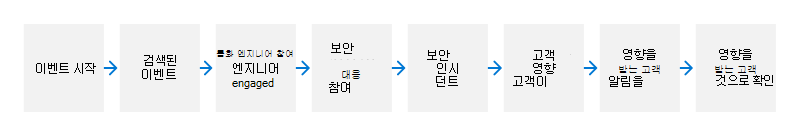

# Microsoft 보안 인시던트 관리: 포함, 삭제 및 복구

보안 대응 팀, 서비스 팀 및 기타에서 수행한 분석에 따라 보안 인시던트의 영향을 최소화하기 위해 적절한 포함 및 복구 계획을 개발합니다. 그런 다음 적절한 서비스 팀은 보안 대응 팀의 지원을 통해 프로덕션에서 해당 계획을 적용합니다.

## 억제

보안 인시던트가 감지된 후 침입을 포함해야 적대가 더 많은 리소스에 액세스하거나 더 많은 손상을 일으킬 수 있습니다. 보안 인시던트 대응 절차의 주요 목표는 고객 또는 해당 데이터 또는 Microsoft 시스템, 서비스 및 응용 프로그램에 대한 영향을 제한하는 것입니다.

## 근절

근절은 높은 신뢰도로 보안 인시던트의 근본 원인을 제거하는 과정입니다. 목표는 다음 두 가지가 있습니다.

- 환경에서 사적을 완전히 제거
- 를 사용하여 악의적인 사용자가 환경을 다시 사용하도록 설정할 수 있는 취약성(알려진 경우)을 완화할 수 있습니다.

인시던트의 특성, 보안 인시던트의 범위, 침투 깊이 및 가능한 상황에 따라 보안 대응 팀은 서비스 팀이 지우기 기술을 채택하는 것이 좋습니다. 이러한 지우기 단계로 인해 발생할 수 있는 잠재적인 비즈니스 영향을 고려할 때 이러한 결정은 서비스 팀과 보안 대응 팀이 임원 인시던트 관리자의 자세한 분석 및 승인(필요한 경우)한 후에 수행합니다.

## 복구

응답 팀이 적대적이 환경에서 제거되고 알려진 모든 취약한 경로를 제거했다는 합리적인 수준의 신뢰를 얻게 하여 개별 서비스 팀은 서비스를 알려진 적절한 구성으로 가져오기 위한 복원 단계를 시작합니다. 이러한 복원 단계는 보안 대응 팀과 협의합니다. 이 활동에는 마지막으로 알려진 서비스의 양호한 상태 식별, 백업에서 이 상태로 복원, 복원된 상태의 취약한 공격 경로 검사 등이 포함됩니다. 보안 대응 팀은 서비스 팀과 협의하여 환경에 가장 적합한 복구 계획을 결정하게 됩니다.

복구의 주요 측면은 복구 계획이 성공적으로 실행되고 환경에 위반 징후가 없는지 확인할 수 있는 향상된 보안 및 제어 기능을 배치하는 것입니다.

## 보안 인시던트에 대한 고객 알림

Microsoft가 보안 인시던트가 발생했다고 판단하면 Microsoft는 부당하게 지연되고 계약 및 규정 준수 요구 사항 내에서 사용자에게 알릴 것입니다. 영향을 받는 모든 테넌트 식별 후 해당 커뮤니케이션 팀은 영향을 받는 테넌트에 적용될 수 있는 관련 규정을 식별하기 위해 작업합니다. 커뮤니케이션 팀은 해당 규정에 정의된 적절한 통신 채널을 사용하여 해당 테넌트 담당자에게 알릴 수 있습니다.

알림에는 인시던트에 대한 자세한 정보(예: 인시던트 설명, 고객 데이터에 대한 영향, 있는 경우, Microsoft에서 취한 작업 및/또는 고객이 문제를 해결하고 재발을 방지하기 위해 취해야 하는 제안된 작업)가 포함됩니다. 알림은 Microsoft 온라인 서비스 테넌트의 지정된 관리자에게 전달됩니다. 알림을 수신하려면 관리자가 테넌트 프로필에서 정확한 연락처 정보를 제공하고 유지 관리해야 합니다. 또한 인시던트의 특성에 따라 Microsoft 365 서비스 상태 대시보드를 통해 알림을 Microsoft 365 [있습니다.](http://status.yammer.com/)

## 관련 문서

- [Microsoft 보안 인시던트 관리](assurance-security-incident-management.md)
- [Microsoft 보안 인시던트 관리: 준비](assurance-sim-preparation.md)
- [Microsoft 보안 인시던트 관리: 검색 및 분석](assurance-sim-detection-analysis.md)
- [Microsoft 보안 인시던트 관리: 인시던트 사후 활동](assurance-sim-post-incident-activity.md)
- [보안 이벤트 지원 티켓을 기록하는 방법](/azure/security/fundamentals/event-support-ticket)
- [Azure 및 Dynamics 365 GDPR의 위반 알림](/compliance/regulatory/gdpr-breach-azure-dynamics)
