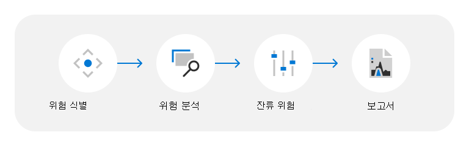

# 데이터 센터 위협, 취약성 및 위험 평가

Microsoft는 연중무휴로 고객에게 200개 이상의 클라우드 서비스를 제공합니다. 몇 가지 예로 Microsoft Azure, Microsoft Office 365, Microsoft Dynamics 등의 엔터프라이즈 서비스 및 Bing, MSN, Outlook.com, Skype 및 Xbox Live 같은 소비자 서비스가 있습니다. 이러한 서비스는 Microsoft의 클라우드 인프라(전역 분산 데이터 센터, 에지 컴퓨팅 노드 및 서비스 운영 센터) 및 세계 최대 글로벌 네트워크 중 하나에서 호스팅됩니다. 광범위한 파이버 공간으로 모두 연결합니다. 1989년에 처음으로 데이터 센터를 개설한 이후 Microsoft는 인프라에 수십억 달러를 투자했으며, 서비스 증가와 함께 운영 및 비용을 효율적으로 관리하면서 계속해서 신뢰할 수 있고 확장이 가능하며 보안이 향상된 온라인 서비스를 유지하는 데 초점을 두고 있습니다.

Microsoft 클라우드 서비스는 최신 기술, 프로세스 및 암호화를 사용하여 클라우드의 고객 데이터 및 애플리케이션을 보호하는 데 중점을 두고, 신뢰와 보안을 기반으로 구축되었습니다. 고객 데이터는 지리적으로 분산되고 심층적인 논리 및 물리 보안 조치 계층에 의해 보호되는 Microsoft 데이터 센터에 저장됩니다. Microsoft 데이터 센터는 자연재해, 환경 위협 또는 무단 접근으로 인한 위험으로부터 서비스 및 데이터를 보호하도록 설계되었고 운영됩니다.

## 위협, 취약성 및 위험 평가 방법론

위협, 취약성 및 위험 평가(TVRA) 프로그램은 Microsoft가 물리적 및 환경적 위협이 Microsoft 데이터 센터에 미치는 영향을 식별하고 완화하는 방법을 이해하는 데 도움이 됩니다. Microsoft는 조건이 변경될 때 개선을 위해 위험 평가 및 방법론을 지속적으로 업데이트하기 위해 최선을 다하고 있습니다. 따라서 TVRA 분석 및 결론은 변경될 수 있으며 보고서는 시점으로 간주됩니다.

Microsoft는 다음 단계에 따라 TVRA 프로세스를 가능하게 합니다.

### 위험 식별

TVAS는 자연 및 사람이 만든(우발적인) 위험 등 다양한 위협 시나리오를 고려합니다. 결과는 데이터 센터 위치, 디자인, 서비스 범위 및 기타 요인에 따라 달라집니다. TVRA는 제3자 및 제1자 위험 정보가 제공하는 위험 환경에 대한 고객 요구 사항, 독립 국가, 도시 및 사이트 수준 평가에 따라 TVRA 문서에서 강조할 위협 시나리오를 선택합니다. 지역에 여러 데이터 센터가 있는 위치의 경우 TVRA 등급을 집계하여 평가되는 위치의 물리적 및 환경 위협, 취약성 및 위험을 전체적으로 확인할 수 있습니다.

TVRA 데이터 센터에 대해 평가된 위협 시나리오의 유형은 다음과 같습니다.

- **외부 위협:** 외부의 의도적 또는 우발적인 인간 활동으로 인한 인시던트입니다. 예를 들어, 시민 장애, 테러, 범죄 활동, 외부 도난, 즉석 폭발 장치, 무기 공격, 불법 공격, 무단 침입 및 비행기 충돌 등이 있습니다.
- **내부 위협:** 내부의 의도적 또는 우발적인 인간 활동으로 인한 인시던트입니다. 예를 들어 내부 도난 및 파괴가 있습니다.
- **자연적 위험:** 데이터 센터에 부정적인 영향을 줄 수 있는 자연적인 프로세스 또는 현상입니다. 예를 들어, 열대성 폭풍, 사이클, 홍수, 산사태, 가뭄, 산불, 지진, 화산 활동, 번개, 우박, 강풍 또는 폭우를 동반한 심한 폭풍입니다.
- **환경 위협:** 데이터 센터에 부정적인 영향을 줄 수 있는 환경 조건입니다. 예를 들어 물 스트레스, 열 스트레스 및 팬데믹스 등이 있습니다.

### 위험 분석

위협은 자신의 내재 위험 평가에 따라 평가됩니다. 내재된 위험은 위협에 대한 본질적인 영향과 관리 작업 및 제어가 없는 경우 위협 발생의 본질적인 가능성의 함수로 계산됩니다. 이러한 평가는 내부 SME 피드백과 외부 위험 지수의 활용을 통해 정보를 제공 받습니다.

### 잔류 위험

잔여 위험은 제어 효율성을 고려한 후 남은 위험 수준을 측정한 것으로 결정됩니다. 컨트롤 효율성은 현재 관리 작업 및 컨트롤이 설계 및 구현된 대로 원하는 효과를 가질 가능성을 평가하면서 위협을 방지하거나 감지하도록 설계된 컨트롤의 측정값으로 평가됩니다. 이러한 평가는 TVRA에서 지정한 데이터 센터 위치에 대한 컨트롤의 효과에 대한 내부 SME 피드백의 집계를 통해 정보를 제공 받습니다.

### 보고서

평가가 완료되면 관리 승인을 위해 TVRA 보고서가 생성되어 위험 관리와 관련된 전반적인 작업을 지원할 수 있습니다.

## 리소스

- [Azure 전역 인프라](https://www.microsoft.com/datacenters)
